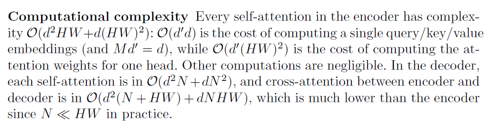

#  1 如何理解DETR的query,其本质是什么

1. encoder的query： 某像素的image feature encoding，用于encoder的输入。通过encoder的注意力机制使得每个像素的feature都能注意到其他的feature。论文实验显示encoder可以区分图像中不同的目标。

2. decoder的query：某个查询结果的embedding，在论文DERT中初始化为0，用于decoder的输入。
3. decoder的object query：某个查询结果的output positional encoding，在论文DERT中使用模型训练得到。某些论文认为是锚框。

很难说本质是什么，比如对于object query，有的说是slot，有的说是锚点，有的说是锚框。

# 2 DETR本身存在什么缺陷

缺陷：主要是1) 收敛慢，DETR论文中训练了500轮。2) 计算复杂度高，与图像宽高平方成正比。

# 3 DETR收敛慢的原因是什么?

主要认为是2种原因：

1) 由于object query一开始是均匀分布的，而目标是稀疏的，要多轮训练才能学习到目标的位置分布。
3) 由于Hungarian Match，使得在不同训练step，同一个query匹配到不同的目标。

# 4 Cross Attention与ROI Pooling之间的联系

都是一种对image feature的加权求和。
Dab DETR认为decoder的object query是一种soft ROI pooling。

# 5 描述DN DETR如何用去噪任务稳定二分图匹配

在decoder部分添加了多组的query，每一组query是所有gt 目标的encoding + 噪声。模型的任务是给这些添加了噪声的query去噪，还原出gt。为了不因为添加这些带噪声的gt而导致信息泄露，添加了cross attention的mask，使得其他的query不会看到这些带噪声的gt信息，并且不同group之间也不会看到对方的信息。

# 6 思考Dab DETR与两阶段检测器之间的关系

问题是不是问Dab DETR和ROI pooling的关系？还是问Deformable DETR和两阶段检测器的关系？

## Dab DETR和ROI pooling的关系

Dab DETR把decoder部分的object query设置为锚框。Decoder预测bbox与锚框坐标的偏移量。并以级联的方式在每一层更新锚框。
这样decoder的object query就是一种soft ROI pooling。

## Deformable DETR和两阶段检测器的关系

Deformable DETR论文中有一种两阶段变体，先根据encoder feature map，使用detection head预测目标分类和bbox偏移量，加上预定义的锚框坐标获得预测的bbox坐标，然后选择top k scoring bbox得到region proposal，作为decoder的初始bbox，即object query的positional embedding。

# 7 Transformer Attention计算量如何计算

主要是开始和结束的proj，和中间Q，K，V矩阵乘积的计算复杂度(假设矩阵A [$m$, $n$], 矩阵B[$n$,$p$]，则AB算法复杂度为$mnp$)。DETR论文中也有描述。

# 8 思考DETR, Dab DETR, DN DETR, DINO, RT DETR是如何一步步发展的

## DETR

CNN + transformer + detection head，使用Hungarian Match匹配pred和gt。

## Dab DETR

添加了锚框先验。把decoder部分的object query设置为锚框。decoder预测bbox与锚框坐标的偏移量。并以级联的方式在每一层更新锚框。

## DN DETR

在decoder部分添加了多组带噪声的gt的query，添加DN Loss绕过Hungarian Match，让模型去噪，从而加速训练。

## DINO

在DN DETR基础上进一步提升训练效果。

1. Constractive denoising training: 给每一组带噪声的query添加了一组负样例的query，从而减少重复预测的概率，并提升对负样例的预测效果。分类loss为focal loss。

2) Mixed query selection 锚框初始化。 使用encoder预测结果的top k输出初始化decoder的锚框，但decoder的content query仍然是训练得到。
3) Look forward twice策略，使得每个检测头的bbox包含前2层decoder的偏移值而不是只有最近的1层decoder，从而更新更多层的参数。

## RT DETR

1) Neck: Hybrid encoder把单尺度特征交互和多尺度特征融合解耦，既实现特征融合，又保证实时性。
与原始DETR一样，只把C5作为transformer encoder的输入。只有一层encoder。
类似PAN结构进行多尺度特征融合。

2) Query Selection: 使用Deformable DETR的两阶段检测策略，选择topk encoder feature和对应的锚框作为decoder输入。

3) Decoder: 以级联的方式在每一层更新bbox，decoder的cross attention使用Deformable attention。

4) Training: 使用DINO的constractive denoising training和look forward twice策略。

5) Loss: 使用Varifocal Loss，把pred与GT的IOU作为分类loss，这样在筛选topk的时候就会综合考虑分类与bbox IOU信息，从而实现IOU aware Query Selection。

